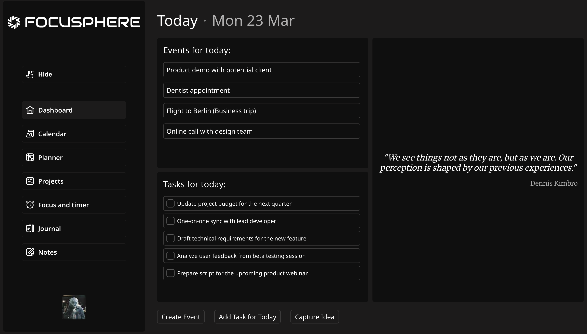
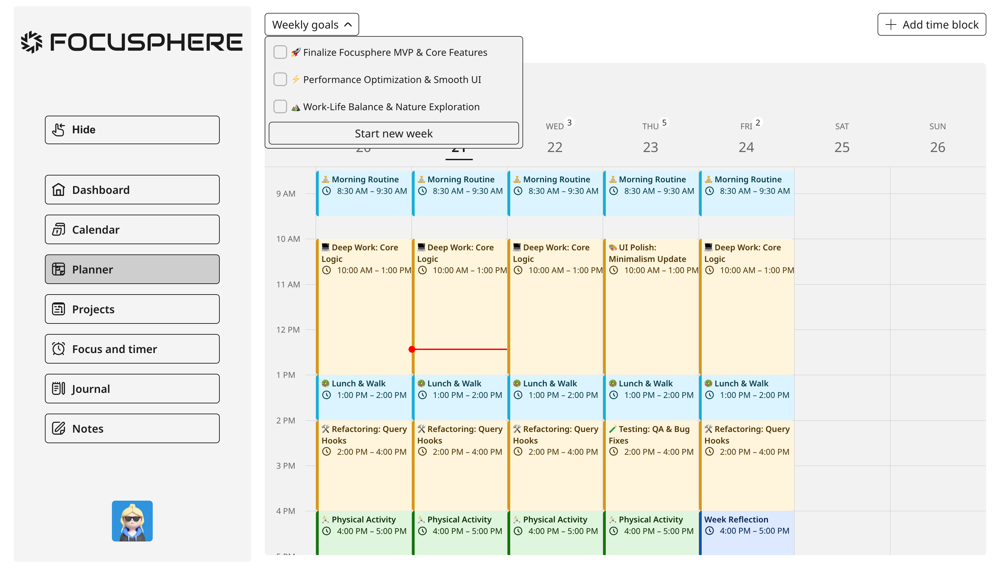
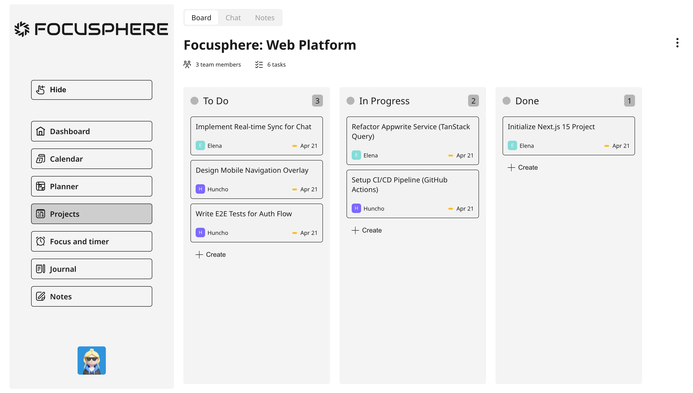
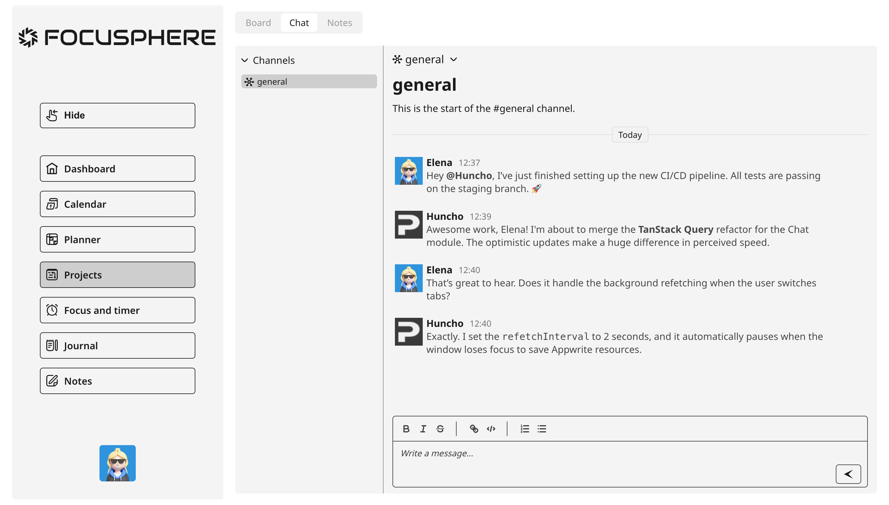
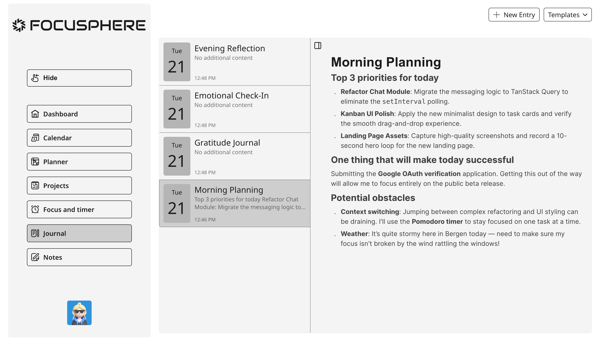

# Focusphere

> **One workspace. Total focus.**

Focusphere is a modern all-in-one productivity platform that brings personal planning and team collaboration under a single roof — so you can stop context-switching and start shipping.

Projects, Kanban, team chat, notes, journal, calendar, time blocks, and a focus timer — all deeply integrated, all in your browser.

## 🔗 Links

- 🌐 **Live Demo**: [focusphere-beta.vercel.app](https://focusphere-beta.vercel.app)
- 📦 **Repository**: [github.com/lisnyaknikita/focusphere](https://github.com/lisnyaknikita/focusphere)

---

## ✨ Why Focusphere?

Most teams juggle 5+ tools: a task tracker, a calendar, a chat app, a note app, and a timer. Focusphere collapses all of that into one coherent experience — without sacrificing depth.

- 🔐 **Complete auth flow** — email/password, Google OAuth, email verification, and password recovery, all out of the box
- 🗂️ **Team project workspace** — Kanban board with drag-and-drop columns & cards, channels-based chat, and shared project notes with a block-based rich text editor
- 🗓️ **Personal productivity stack** — full calendar with drag-to-create & resize, daily planner with time blocks, goals & tasks, a private journal, and a Pomodoro-style focus timer
- ⚡ **Polished client UX** — optimistic updates, autosave, smooth animations, smart modals, toast notifications, and instant feedback on every action

---

## 🛠️ Tech Stack

### Core

| Layer     | Technology                                                                      |
| --------- | ------------------------------------------------------------------------------- |
| Framework | [Next.js 15](https://nextjs.org/) (App Router) + [React 19](https://react.dev/) |
| Language  | [TypeScript](https://www.typescriptlang.org/)                                   |
| Styling   | [Sass / SCSS Modules](https://sass-lang.com/)                                   |
| Backend   | [Appwrite](https://appwrite.io/) — Auth, Database, Storage, Teams               |

### State & Data

| Layer        | Technology                                                                                     |
| ------------ | ---------------------------------------------------------------------------------------------- |
| Server state | [TanStack Query v5](https://tanstack.com/query) — caching, background sync, optimistic updates |
| Client state | [Zustand](https://zustand-demo.pmnd.rs/) — lightweight global store                            |
| Forms        | [React Hook Form](https://react-hook-form.com/) + [Zod](https://zod.dev/)                      |

### UI & Interaction

| Library                                                                | Purpose                                                   |
| ---------------------------------------------------------------------- | --------------------------------------------------------- |
| [BlockNote](https://www.blocknotejs.org/)                              | Block-based rich text editor for notes                    |
| [dnd-kit](https://dndkit.com/)                                         | Drag-and-drop for Kanban columns and cards                |
| [Framer Motion](https://www.framer.com/motion/)                        | Page transitions and micro-animations                     |
| [Schedule-X](https://schedule-x.dev/)                                  | Full-featured calendar with drag, resize, and event modal |
| [Floating UI](https://floating-ui.com/)                                | Tooltips, dropdowns, and smart popover positioning        |
| [Sonner](https://sonner.emilkowal.ski/)                                | Elegant toast notifications                               |
| [React Day Picker](https://react-day-picker.js.org/)                   | Accessible date picker component                          |
| [React Time Picker](https://github.com/wojtekmaj/react-time-picker)    | Time input for planner events                             |
| [Temporal Polyfill](https://github.com/fullcalendar/temporal-polyfill) | Modern date/time handling via the TC39 Temporal API       |
| [react-spinners](https://www.davidhu.io/react-spinners/)               | Smooth loading states                                     |
| [clsx](https://github.com/lukeed/clsx)                                 | Conditional class name utility                            |

---

### State Strategy

- **TanStack Query** — all server-fetched data: caching, deduplication, background refetching, and optimistic mutations
- **Zustand** — lightweight client-only state
- **React Hook Form** — form state, validation, and submission handling
- Local component state for ephemeral, view-scoped interactions

---

## 📸 Screenshots

### Dashboard

### Planner page

### Project page(kanban board)

### Project page(team chat)

### Journal page

