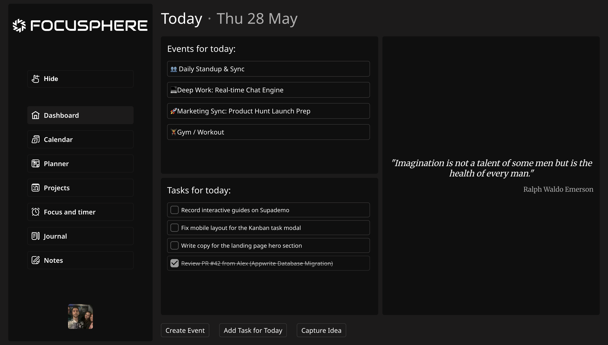
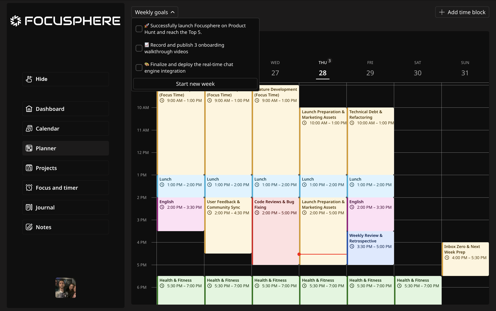
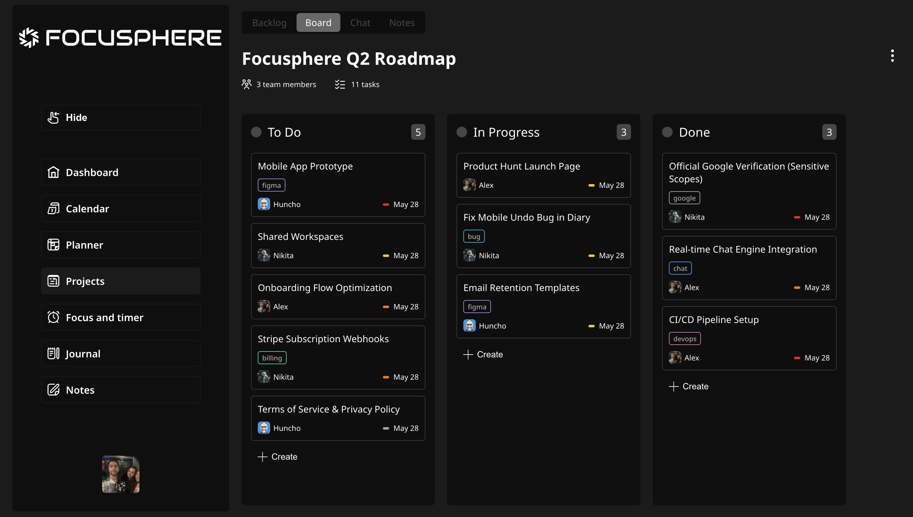
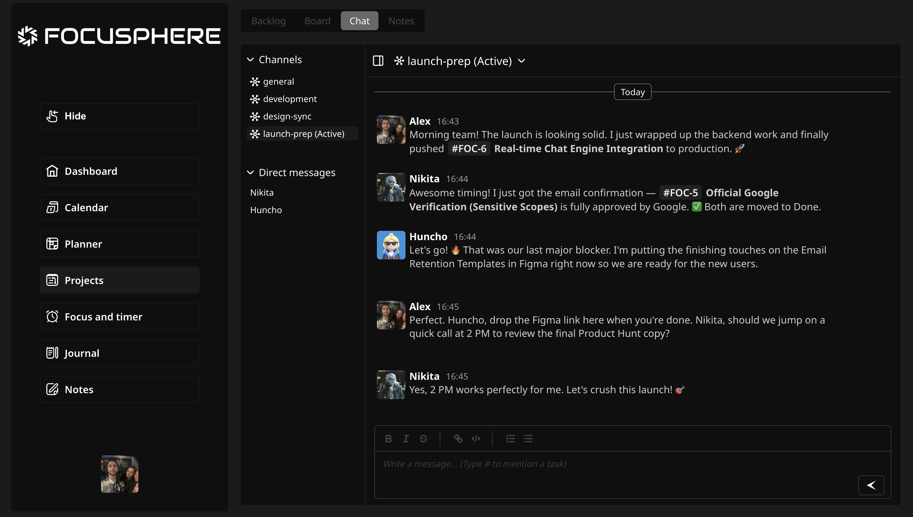
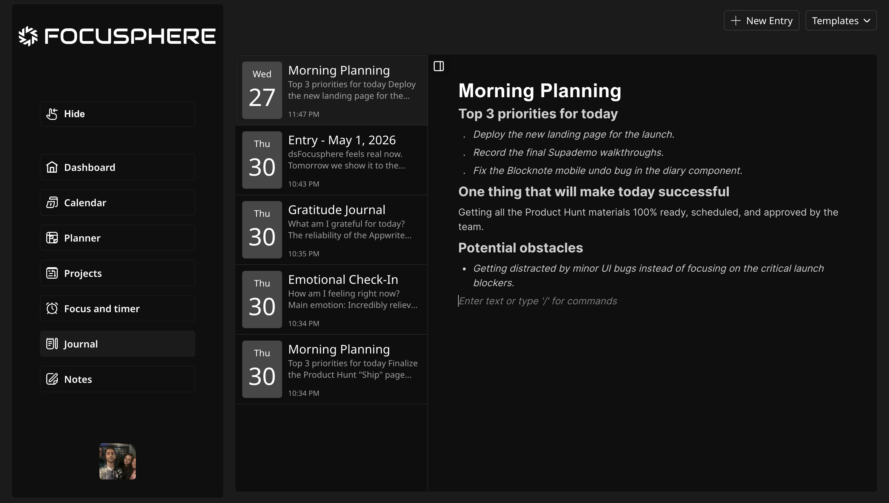

<div align="center">


# Focusphere

**One workspace. Total focus.**

Focusphere is a modern all-in-one productivity platform that brings personal planning and team collaboration under a single roof — so you can stop context-switching and start shipping.

[](https://nextjs.org/)
[](https://www.typescriptlang.org/)
[](https://appwrite.io/)

</div>

---

🌐 [focusphere.org](https://focusphere.org) — live, deployed, fully functional.

---

## ✨ What is Focusphere?

Most teams juggle 5+ tools: a task tracker, a calendar, a chat app, a note app, and a timer. Focusphere collapses all of that into one coherent experience — without sacrificing depth.

| Feature                      | Description                                                                               |
| ---------------------------- | ----------------------------------------------------------------------------------------- |
| 🔐 **Auth**                  | Email/password, Google OAuth, email verification, password recovery                       |
| 🗂️ **Project Workspace**     | Kanban board (DnD), Backlog, real-time channel chat, block-based shared notes             |
| 🗓️ **Personal Productivity** | Full calendar, daily time-block planner, goals & tasks, private journal                   |
| ⏱️ **Focus Timer**           | Pomodoro-style timer with ambient sounds (Lofi, Pink noise, Brown noise)                  |
| ⚡ **Polished UX**           | Optimistic updates, autosave, Framer Motion animations, smart modals, toast notifications |
| 🌓 **Theming**               | Full dark / light mode with system preference detection                                   |

---

## 📸 Screenshots

<!-- SCREENSHOT PLACEHOLDER: Replace the lines below with your actual screenshots -->
<!-- Tip: use dark & light variants side by side for maximum visual impact -->

### Dashboard



### Planner



### Kanban Board



### Team Chat



### Journal



---

## 🛠️ Tech Stack

### Core

| Layer     | Technology                                                                      |
| --------- | ------------------------------------------------------------------------------- |
| Framework | [Next.js 15](https://nextjs.org/) (App Router) + [React 19](https://react.dev/) |
| Language  | [TypeScript](https://www.typescriptlang.org/)                                   |
| Styling   | [Sass / SCSS Modules](https://sass-lang.com/)                                   |
| Backend   | [Appwrite](https://appwrite.io/) — Auth, Realtime, Database, Storage, Teams     |

### State & Data

| Layer        | Technology                                                                                     |
| ------------ | ---------------------------------------------------------------------------------------------- |
| Server state | [TanStack Query v5](https://tanstack.com/query) — caching, deduplication, optimistic mutations |
| Real-time    | [Appwrite Subscriptions](https://appwrite.io/docs/apis/realtime/subscribe) — WebSocket events  |
| Client state | [Zustand](https://zustand-demo.pmnd.rs/) — lightweight global store with `persist` middleware  |
| Forms        | [React Hook Form](https://react-hook-form.com/) + [Zod](https://zod.dev/) validation           |

### UI & Interaction

| Library                                                                | Purpose                                                   |
| ---------------------------------------------------------------------- | --------------------------------------------------------- |
| [BlockNote](https://www.blocknotejs.org/)                              | Block-based rich text editor for notes                    |
| [dnd-kit](https://dndkit.com/)                                         | Drag-and-drop for Kanban columns and cards                |
| [Framer Motion](https://www.framer.com/motion/)                        | Page transitions and micro-animations                     |
| [Schedule-X](https://schedule-x.dev/)                                  | Full-featured calendar with drag, resize, and event modal |
| [Floating UI](https://floating-ui.com/)                                | Tooltips, dropdowns, and smart popover positioning        |
| [Sonner](https://sonner.emilkowal.ski/)                                | Elegant toast notifications                               |
| [React Day Picker](https://react-day-picker.js.org/)                   | Accessible date picker                                    |
| [Temporal Polyfill](https://github.com/fullcalendar/temporal-polyfill) | Modern date/time via TC39 Temporal API                    |

---

## 🏛️ Architecture

```
┌──────────────────────────────────────────────────────────┐
│                    Next.js 15 Client                     │
│                                                          │
│   ┌─────────────┐   ┌──────────────┐   ┌─────────────┐  │
│   │   Zustand   │   │ TanStack     │   │ React Hook  │  │
│   │ (UI State)  │   │ Query        │   │ Form + Zod  │  │
│   │             │   │ (Server Cache│   │ (Forms)     │  │
│   └─────────────┘   └──────┬───────┘   └─────────────┘  │
│                             │                            │
└─────────────────────────────┼────────────────────────────┘
                              │ REST + WebSocket
                    ┌─────────▼─────────┐
                    │  Appwrite Backend  │
                    │                   │
                    │  ┌─────────────┐  │
                    │  │    Auth     │  │
                    │  │  Database   │  │
                    │  │  Storage    │  │
                    │  │   Teams     │  │
                    │  │  Realtime   │◄─┼── WebSocket Subscriptions
                    │  └─────────────┘  │    (Chat messages, live sync)
                    └───────────────────┘
```

### State Strategy

- **TanStack Query** — all server-fetched data: caching, deduplication, background refetching, and optimistic mutations
- **Zustand** — lightweight client-only state (timer, focus mode) with `persist` middleware for cross-tab / cross-session survival
- **React Hook Form** — form state, validation, and submission handling
- **Local component state** — ephemeral, view-scoped interactions only

---

## 🧠 Engineering Challenges

These are non-trivial problems solved during development — the kind that don't show up in tutorials.

### 1. 🕐 Background-Tab-Resistant Pomodoro Timer

**The Problem:** Browsers throttle `setInterval` to once per minute (or slower) when a tab is not active. A native timer implementation would lose time or desync when the user switches tabs.

**The Solution:** Instead of tracking elapsed time with a counter, the timer stores an absolute **UTC expiry timestamp** (`Date.now() + secondsLeft * 1000`) in Zustand with `persist` middleware. On every tick, the remaining time is calculated as `expiry - Date.now()`. This means:

- The timer is always accurate, even after tab switching or browser sleep.
- The state survives page refreshes — the timer keeps running after an F5.
- The `setInterval` is only used to trigger UI re-renders, not to track time.

```ts
// The tick does not count up — it reads from an absolute timestamp
const distance = Math.max(0, Math.round((expiry - Date.now()) / 1000))
```

---

### 2. 💬 WebSocket Message Reconciliation

**The Problem:** When a user sends a chat message, it should appear instantly (optimistic UI) without waiting for the server round-trip. But when the Appwrite WebSocket event fires confirming the creation, we'd get a **duplicate** message in the list.

**The Solution:** When sending a message, a temporary local message with a `temp-` prefixed ID is added to state immediately. When the WebSocket `create` event arrives, the handler first checks if a matching `temp-` message already exists by comparing `senderId` and `content`. If found, it **replaces** the temp entry with the real one instead of appending a new one:

```ts
const tempMessageIndex = prev.findIndex(
	m => m.$id.startsWith('temp-') && m.senderId === payload.senderId && m.content === payload.content
)
if (tempMessageIndex !== -1) {
	updatedMessages[tempMessageIndex] = payload // replace, not append
	return updatedMessages
}
return [...prev, payload]
```

---

### 3. ⚡ Optimistic Mutations with Instant Rollback

**The Problem:** Waiting for the server to confirm every task move, title edit, or priority change makes the UI feel sluggish.

**The Solution:** All mutations follow a **snapshot → apply → confirm → rollback** pattern. Before any API call, the current state is snapshotted. The UI is updated immediately. If the API call fails, the snapshot is restored and the user is notified:

```ts
const updateTask = async (taskId, data) => {
	const previousTasks = [...tasks] // 1. snapshot
	setTasks(prev => prev.map(t => (t.$id === taskId ? { ...t, ...data } : t))) // 2. apply instantly
	try {
		await updateKanbanTask(taskId, data) // 3. confirm
	} catch {
		setTasks(previousTasks) // 4. rollback on failure
		toast.error('Failed to update task')
	}
}
```

---

### 4. 🗒️ Task → Note Deep Linking

Tasks can be converted into Notes in one click. When creating a note from a task, the note title is automatically prefixed with the project's task code (e.g. `APP-12: Fix login bug`). This preserves traceability between the Kanban board and the project's knowledge base — a feature inspired by tools like Linear and Jira.

---

## 📁 Project Structure

```
src/
├── app/
│   ├── (auth)/          # Login, signup, verification pages
│   ├── (landing)/       # Public marketing landing page
│   └── (main)/          # Protected app shell
│       ├── dashboard/
│       ├── calendar/
│       ├── planner/
│       ├── timer/
│       ├── journal/
│       ├── notes/
│       └── projects/
│           └── [id]/
│               ├── board/    # Kanban board + task modals
│               ├── backlog/  # Backlog list view
│               ├── chat/     # Real-time team chat
│               └── notes/    # Shared project notes
├── lib/                 # Appwrite API wrappers
└── shared/
    ├── hooks/           # Feature-specific custom hooks
    ├── stores/          # Zustand stores
    ├── types/           # TypeScript interfaces
    └── ui/              # Reusable components
```

---

## 🔗 Links

- 🌐 **Live Demo**: [focusphere.org](https://focusphere.org)
- 📦 **Repository**: [github.com/lisnyaknikita/focusphere](https://github.com/lisnyaknikita/focusphere)
