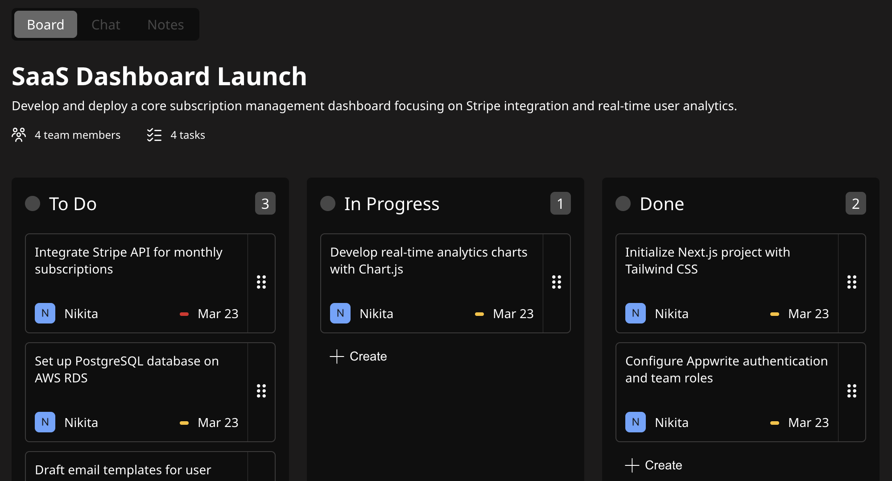

# Focusphere

Focusphere is a productivity platform that combines personal planning and team collaboration in one web app.

It includes projects, Kanban board, team chat, notes, journal, calendar, planner, and focus timer in a single workflow.

## Live & Repository

- Live Demo: https://focusphere-test.vercel.app
- Repository: `https://github.com/lisnyaknikita/focusphere`

## Product Highlights

- End-to-end auth flow: email/password, Google OAuth, email verification, password recovery
- Team project workspace: Kanban board, channels-based chat, project notes
- Personal productivity stack: calendar, planner (time blocks/goals/tasks), journal, focus timer
- Rich client UX: modals, autosave patterns, optimistic updates, drag-and-drop calendar interactions

## Screenshots

### Dashboard

### Kanban Board

## Tech Stack

- Framework: [Next.js 15 (App Router)](https://nextjs.org/), [React 19](https://react.dev/), [TypeScript](https://www.typescriptlang.org/)
- Styling: [Sass / SCSS Modules](https://sass-lang.com/)
- Forms and validation: [React Hook Form](https://react-hook-form.com/), [Zod](https://zod.dev/)
- UI/UX libraries: [Framer Motion](https://www.framer.com/motion/), [dnd-kit](https://dndkit.com/)
- Calendar engine: [Schedule-X](https://schedule-x.dev/)
- Backend platform: [Appwrite](https://appwrite.io/) (Auth, Database, Storage, Teams)

## Architecture Overview

- `src/app`: route groups and pages (`(landing)`, `(auth)`, `(main)`)
- `src/shared`: reusable UI, hooks, contexts, types, utils
- `src/lib`: Appwrite integration and domain-level data access modules

State approach:

- Local state for view-level interactions
- React Context for cross-screen domain/UI state
- Custom hooks for orchestration and side effects
